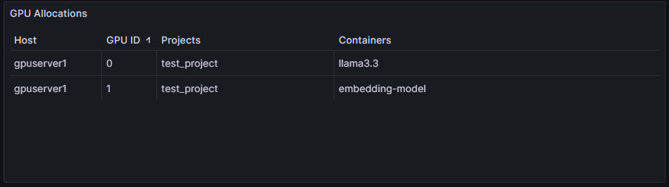

# GPU Allocation Prometheus Exporter

Prometheus exporter for monitoring GPU allocation in Docker containers.

## Features

- Exposes Prometheus metrics on GPU usage by container and Compose project.
- Designed for use with NVIDIA GPUs and Docker Compose.
- Publishes Docker images via GitHub Actions.

## Usage

### With Docker Compose (local repo)

```sh
docker compose up --build
```

Metrics will be available at [http://localhost:8300/metrics](http://localhost:8300/metrics).

### With Docker Compose (using published image)

Create a `docker-compose.yml` like:

```yaml
version: "3.8"
services:
  gpu-alloc-exporter:
    image: ghcr.io/conx/gpu-alloc-exporter:latest
    ports:
      - "8300:8000" # Map host port 8300 to exporter port 8000
    environment:
      - EXPORTER_PORT=8000
    volumes:
      - /var/run/docker.sock:/var/run/docker.sock:ro
      - /usr/bin/nvidia-smi:/usr/bin/nvidia-smi:ro
```

Then run:

```sh
docker compose up
```

Metrics will be available at [http://localhost:8300/metrics](http://localhost:8300/metrics).

### With Docker

```sh
docker run -d \
  -p 8300:8000 \
  -e EXPORTER_PORT=8000 \
  -v /var/run/docker.sock:/var/run/docker.sock:ro \
  -v /usr/bin/nvidia-smi:/usr/bin/nvidia-smi:ro \
  ghcr.io/conx/gpu-alloc-exporter:latest
```

Metrics will be available at [http://localhost:8300/metrics](http://localhost:8300/metrics).

## Visualizing in Grafana



To visualize GPU allocations in Grafana using the exported Prometheus metrics:

1. **Add Prometheus as a data source** in Grafana.
2. **Create a new dashboard and add a Table panel.**
3. **Use the following PromQL expression** to select containers using GPUs:
   ```promql
   gpu_container_allocation == 1
   ```
4. **Set the panel format to "Table".**
5. **Apply these transformations** in the panel:
   - **Labels to fields:** Converts Prometheus labels (e.g., `gpu`, `container`, `compose_project`, `instance`) into table columns.
   - **Group by:** Group rows by `gpu`, `container`, `compose_project`, and `instance` as needed.
   - **Organize fields:** Optionally rename columns for clarity (e.g., `gpu` → "GPU ID", `container` → "Containers", `compose_project` → "Projects", `instance` → "Host") and adjust column order/width.

This setup will display a table showing which containers are using which GPUs, grouped by project and host if desired. Adjust the panel options and transformations to match your Grafana version and preferences.

### Environment Variables

- `EXPORTER_PORT`: Port to expose metrics (default: 8000).

### Docker Requirements

- NVIDIA GPU drivers and `nvidia-smi` available on the host.
- Docker socket and `nvidia-smi` must be mounted as read-only.

## Development

- Python 3.11+
- [uv](https://github.com/astral-sh/uv) for dependency management.

### Install dependencies

```sh
uv sync
```

### Run locally

```sh
python exporter/gpu_alloc_exporter.py
```

## Building and Publishing Docker Images

Docker images are built and published automatically to GitHub Container Registry via GitHub Actions.

## License

MIT License
